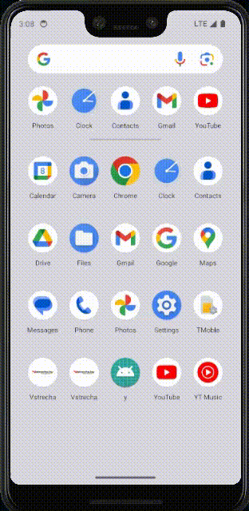
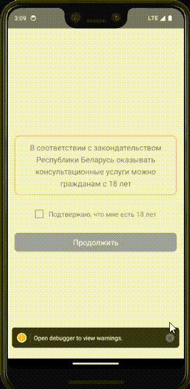
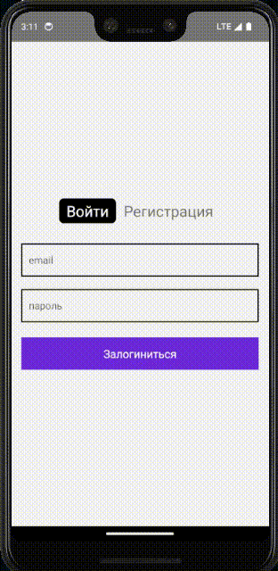

<h1>Mobile application for a medical institution on Android/iOS</h1>

<h3>Stacks:</h3>
<ul>
	<li>React Native</li>
	<li>NestJS</li>
</ul>

<h3>Results:</h3>

<table>
	<tr>
		<td>
			<h3>Splash</h3>
			
		</td>
		<td>
			<h3>Register</h3>
			
		</td>
		<td>
			<h3>Login</h3>
			
		</td>
	</tr>
	<tr>
		<td>
			<h3>Institutions list</h3>
			
		</td>
		<td>
			<h3>Institutions load more</h3>
			
		</td>
		<td>
			<h3>Institutions search</h3>
			
		</td>
	</tr>
	<tr>
		<td>
			<h3>Institutions filter</h3>
			
		</td>
		<td>
			<h3>Institution info</h3>
			
		</td>
		<td>
			<h3>Hotlines</h3>
			
		</td>
	</tr>
</table>
